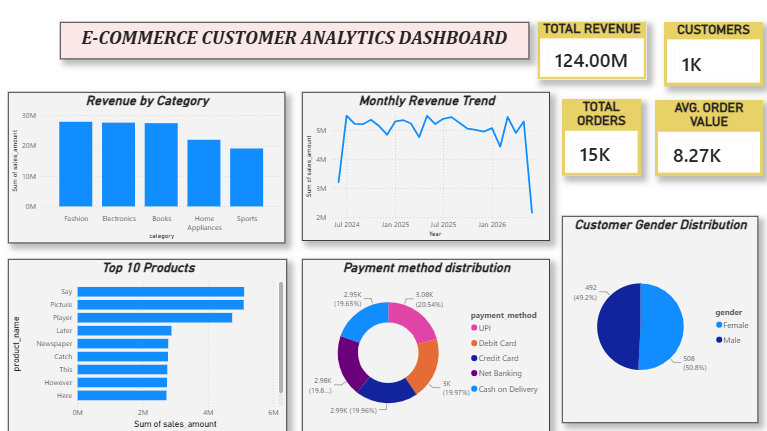

# E-Commerce Customer Analytics

End-to-end E-Commerce Customer Analytics project using Python, MySQL, Power BI, and GitHub. The project analyzes customer purchasing behavior, product performance, payment trends, and business revenue through data generation, SQL analysis, and interactive dashboards.

## Project Overview

This project simulates an e-commerce business environment by generating customer, product, order, payment, and review datasets. The data is stored in MySQL, analyzed using SQL queries, and visualized through Power BI dashboards.

## Tech Stack

* Python
* Pandas
* MySQL
* SQL
* Power BI
* Git & GitHub

## Project Structure

ecommerce_customer_analytics/

retail-supply-chain-analytics
│
├── data
│   ├── raw
│   │   ├── customers.csv
│   │   ├── products.csv
│   │   ├── payments.csv
│   │   ├── reviews.csv
│   │   └── orders.csv
│   │
│   └── processed
│       └── orders_cleaned.csv
│
├── python
│   ├── generate_dataset.py
│
├── sql
│   ├── schema.sql
│   └── analysis_queries.sql
│
├── powerbi
│   └── Ecommerce_Customer_Analytics.pbix
│
├── images
│   └── dashboard_ecommerce.png
│
└── README.md

## Datasets

### Customers

* 1,000 customer records
* Customer demographics and signup information

### Products

* 50 products across multiple categories
* Product pricing and category information

### Orders

* 15,000 customer orders
* Order quantity, sales amount, and purchase dates

### Payments

* 15,000 payment transactions
* Multiple payment methods and payment statuses

### Reviews

* 8,000 customer reviews
* Product ratings and review dates

## SQL Analysis Performed

* Total Revenue Analysis
* Total Customers Analysis
* Total Orders Analysis
* Average Order Value
* Revenue by Product Category
* Top Revenue Generating Customers
* Payment Method Analysis
* Product Rating Analysis

## Key Business Insights

* Generated revenue of ₹124M+
* Analyzed 15,000 customer orders
* Identified top-performing product categories
* Evaluated payment method preferences
* Measured customer satisfaction using product ratings

## Power BI Dashboard

The interactive dashboard includes:

* Total Revenue KPI
* Total Customers KPI
* Total Orders KPI
* Average Order Value KPI
* Revenue by Category
* Monthly Revenue Trend
* Top 10 Products Analysis
* Payment Method Distribution
* Customer Gender Distribution

## Dashboard Preview

## Author
Kashish Jain